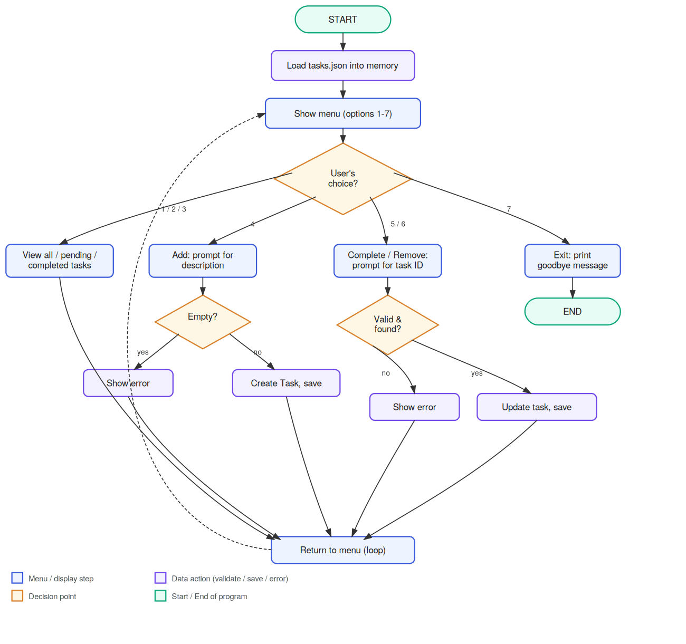

# To-Do List Manager (CLI)

A simple, self-contained command-line To-Do List Manager written in
pure Python (no external dependencies). Tasks persist between runs
in a local `tasks.json` file.

---

## 1. Project Structure

```
todo_app/
├── main.py            # Entry point — run this file to start the app
├── cli.py             # User interaction layer (menus, input, printing)
├── task_manager.py     # Business logic layer (add/remove/complete/list/save/load)
├── task.py             # Task data model (a single to-do item)
├── tests/
│   └── test_manager.py # Automated unit tests for TaskManager
├── tasks.json          # Auto-created on first run; stores your tasks
└── README.md
```

### Why this structure? (Design Decisions)

The app is split into three layers, following the **separation of
concerns** principle:

| Layer | File | Responsibility |
|---|---|---|
| Data model | `task.py` | Represents a single task and knows how to convert itself to/from a dictionary (for saving as JSON). Has zero knowledge of the UI or file system. |
| Business logic | `task_manager.py` | Owns the actual list of tasks. Handles adding, removing, completing, filtering, and saving/loading. Contains all validation rules. Has zero knowledge of `input()`/`print()`. |
| Interface | `cli.py` + `main.py` | Shows menus, reads raw user input, calls `TaskManager` methods, and displays results. Contains no business rules itself. |

**Why bother separating these?**
- **Testability** — `task_manager.py` can be fully unit-tested without
  simulating keyboard input (see `tests/test_manager.py`).
- **Maintainability** — if the task rules change (e.g. add due dates),
  only `task.py`/`task_manager.py` need to change, not the menu code.
- **Reusability** — `TaskManager` could power a future GUI or web
  version with no changes.

Persistence uses a plain **JSON file** rather than a database because
it needs no setup, no dependencies, and is easy to open and inspect
by hand — appropriate for a simple single-user CLI tool.

---

## 2. Application Flow

### Visual diagram



(A vector version is also included as `flow_diagram.svg` if you need to
zoom in or edit it.)

### Pseudocode

```
START
  Load tasks from tasks.json (if it exists) into memory
  LOOP forever:
    Show menu (View all / pending / completed, Add, Complete, Remove, Exit)
    Read user's menu choice
    IF choice is "Add":
        Ask for description
        IF description is empty -> show error, loop again
        ELSE -> create Task, assign next ID, append to list, save to file
    IF choice is "Complete":
        Ask for task ID
        IF ID is not a number -> show error, loop again
        IF ID not found -> show error, loop again
        ELSE -> mark task completed, save to file
    IF choice is "Remove":
        (same ID validation as above)
        ELSE -> remove task from list, save to file
    IF choice is "View ...":
        Filter task list (all / pending / completed) and print it
    IF choice is "Exit":
        Print goodbye message, break loop
  END LOOP
END
```

Every write operation (add/remove/complete) immediately calls
`save_tasks()`, so you can safely close the app (or it can crash)
without losing progress from earlier actions.

---

## 3. Requirements

- Python 3.7 or later
- No external/third-party packages — only the Python standard library
  (`json`, `os`, `datetime`, `unittest`) is used.

---

## 4. How to Run

1. Unzip the archive and open a terminal in the `todo_app/` folder.
2. Run:
   ```bash
   python main.py
   ```
   (On some systems the command is `python3 main.py`.)
3. Follow the on-screen menu (enter a number 1–7).

Your tasks are automatically saved to `tasks.json` in the same folder,
and reloaded automatically the next time you start the app.

---

## 5. Features

- **Add** a task (with a text description)
- **View** all tasks, or filter to only **pending** or only **completed**
- **Mark a task as completed** by its ID
- **Remove** a task by its ID
- **Persistent storage** — tasks survive between runs
- **Input validation & error handling**:
  - Empty/blank task descriptions are rejected with a message
  - Non-numeric task IDs are rejected with a message
  - Unknown task IDs (for complete/remove) show a clear error instead of crashing
  - A corrupted or unreadable `tasks.json` won't crash the app — it starts fresh with a warning
  - `Ctrl+C` exits cleanly instead of showing a traceback

---

## 6. Manual Test Scenarios

You can verify the app works correctly by trying these scenarios in order:

| # | Steps | Expected Result |
|---|---|---|
| 1 | Start app, choose `1` (View all) on first run | "(no tasks to show)" — list is empty |
| 2 | Choose `4`, enter "Buy milk" | "Added task #1: Buy milk" |
| 3 | Choose `4`, press Enter without typing anything | "Error: Task description cannot be empty." |
| 4 | Choose `1` (View all) | Shows task #1, marked `[✘]` (pending) |
| 5 | Choose `5`, enter `1` | "Marked task #1 as completed." |
| 6 | Choose `3` (View completed) | Shows task #1 marked `[✔]` |
| 7 | Choose `2` (View pending) | "(no tasks to show)" |
| 8 | Choose `5`, enter `abc` | "Invalid input: please enter a numeric task ID." |
| 9 | Choose `6`, enter `999` | "Error: No task found with ID 999." |
| 10 | Choose `6`, enter `1` | "Removed task #1: Buy milk" |
| 11 | Choose `7` | "Goodbye! Your tasks have been saved." — app exits |
| 12 | Restart the app, choose `1` | Confirms tasks that existed before exit are still there (persistence check) |

### Automated Tests

A `unittest`-based test suite is included and covers adding, removing,
completing, filtering, error cases, and persistence across restarts.

Run it from the `todo_app/` folder with:

```bash
python -m unittest discover tests -v
```

All 9 tests should pass (`OK`).

---

## 7. Possible Future Enhancements

(Not implemented, but the modular design makes these easy to add later)
- Due dates / priority levels on tasks
- Editing an existing task's description
- Sorting/searching tasks
- Command-line arguments (e.g. `python main.py add "Buy milk"`) instead of the menu, for scripting use
